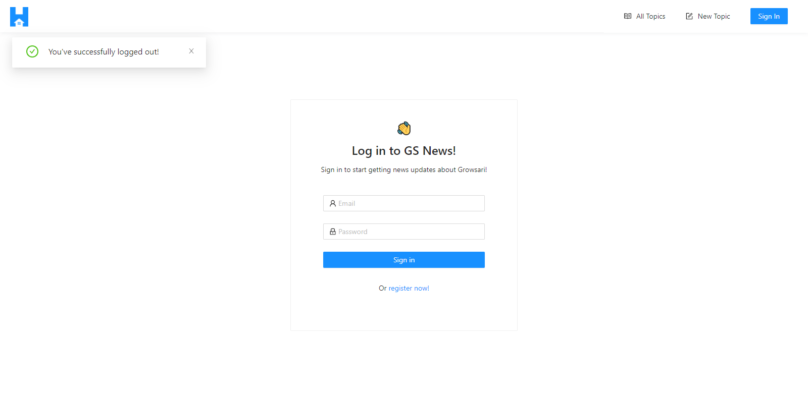
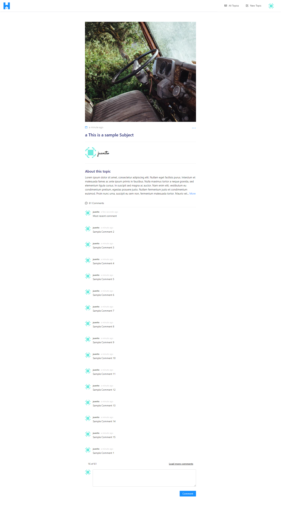

# GS News Fullstack Application

[](https://travis-ci.com/1byte-yoda/gs-news-app)


<!-- PROJECT LOGO -->
<br />
<p align="center">
  <!-- <a href="https://github.com/PHmark/gs-news-app">
    
  </a> -->

  <h3 align="center">GS News Fullstack Application [*Under Development]</h3>

  <p align="center">
    Stay updated with GS News!
    <br />
    <a href="https://github.com/PHmark/gs-news-app"><strong>Explore the docs »</strong></a>
    <br />
    <br />
    <a href="https://github.com/PHmark/gs-news-app">View Demo</a>
    ·
    <a href="https://github.com/PHmark/gs-news-app/issues">Report Bug</a>
    ·
    <a href="https://github.com/PHmark/gs-news-app/issues">Request Feature</a>
  </p>
</p>

<!-- TABLE OF CONTENTS -->
## Table of Contents

* [About the Project](#about-the-project)
  * [Built With](#built-with)
* [Getting Started](#getting-started)
  * [Prerequisites](#prerequisites)
  * [Installation](#installation)
* [Workflow](#workflow)
* [Contact](#contact)

<!-- ABOUT THE PROJECT -->
## About The Project






### Built With

* [Python 3](https://www.python.org/)
* [Flask](https://flask.palletsprojects.com/en/1.1.x/)
* [Typescript React](https://reactjs.org/)
* [Ant Design](https://ant.design/)
* [PostgreSQL](https://www.postgresql.org/)
* [GraphQL](https://graphql.org/)

#
<!-- GETTING STARTED -->
## Getting Started

To get a local copy up and running follow these simple steps.

### Prerequisites

Make sure you have the following software installed and running on your computer:
* [Docker](https://docs.docker.com/get-docker/)
* [Docker Compose](https://docs.docker.com/compose/install/)
* [Docker Machine](https://docs.docker.com/machine/install-machine)
* [Virtual Box](https://www.virtualbox.org/wiki/Downloads)

Check docker version
```sh
$ docker -v
Docker version 19.03.13, build 4484c46d9d
```

Check docker-compose version
```sh
$ docker-compose -v
docker-compose version 1.27.4, build 40524192
```

Check docker-machine version
```sh
$ docker-machine -v
docker-machine version 0.16.0, build 702c267f
```

### Installation

1. Clone the repo
```sh
$ git clone https://github.com/PHmark/gs-news-app.git
```
2. Create a docker machine inside a virtualbox
```sh
$ docker-machine create -d virtualbox gs-news-app
```
3. Run the docker-machine (Linux):
```sh
$ eval "$(docker-machine env gs-news-app)"
```
- _For Windows users, use the command_
```sh
$ @FOR /f "tokens=*" %i IN ('docker-machine env gs-news-app') DO @%i
```
* Make sure you Docker client is pointed to gs-news-app virtualbox
```sh
$ docker-machine ls

NAME             ACTIVE   DRIVER       STATE     URL                         SWARM   DOCKER      ERRORS   
gs-news-app      *        virtualbox   Running   tcp://192.168.99.107:2376           v19.03.12

```
4. Install using docker-compose
```sh
$ docker-compose build
```

#
<!-- USAGE EXAMPLES -->
## Workflow
### 0. Get the IP Address of the virtualbox and set React App's URL environment variable:
```sh
$ docker-machine ip gs-news-app
192.168.99.107

# For Linux
$ export REACT_APP_API_SERVICE_URL=http://192.168.99.107

# For windows
$ set REACT_APP_API_SERVICE_URL=http://192.168.99.107
```

### 1. Running the web application:
```
$ docker-compose up -d
```

### 2. Seed the database:
```
$ docker-compose run api python manage.py seed_db
```

### 3. Running unit tests:
```
$ docker-compose run api python manage.py test
```

### 4. Verify flake8 code compliance:
```
$ docker-compose run api flake8 app
```

### 5. Show test coverage summary:
```
$ docker-compose run api python manage.py cov
```

### 6. Open your virtualbox's _IP Address_ on web browser, on the example above the IP Address was _192.168.99.107_. (Might take some time for the React App to load.)

#
## Quick snapshot of the Application's API endpoints.
* _[POST] /user/register__ - User account registration
* _[POST] /user/login_ - User account login
* _[POST] /topic_ - Creation of a topic
* _[PATCH] /topic_ - Update a topic
* _[DELETE] /topic_ - Delete a topic
* _[POST] /topic/{id}/message_ - Create a message on a topic.
* _[GET] /topics_ - Retrieve all topics.
*  _[GET] /topic/{id}/messages_ - Retrieve all messages in a topic.
#
<!-- CONTACT -->
## Contact

Mark - dmc.markr@gmail.com

Project Link: [https://github.com/PHmark/gs-news-app](https://github.com/PHmark/gs-news-app)


<!-- MARKDOWN LINKS & IMAGES -->
<!-- https://www.markdownguide.org/basic-syntax/#reference-style-links -->
[product-screenshot]: images/screenshot.png
